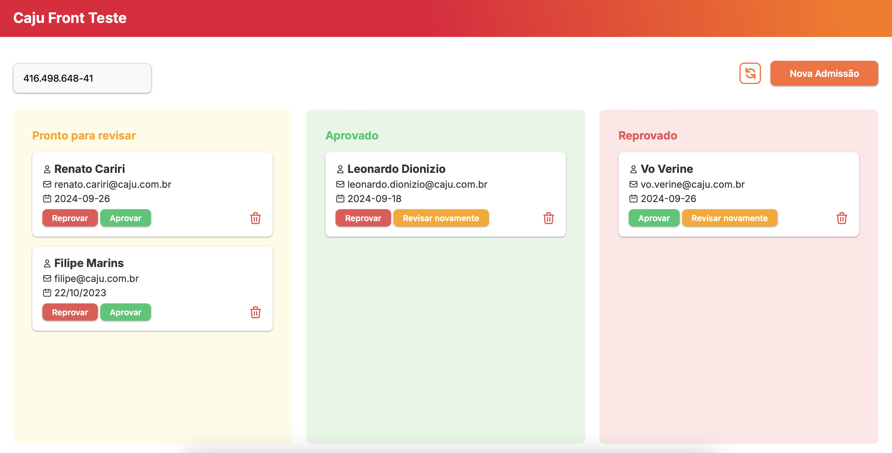
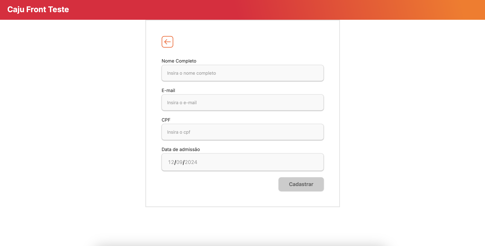

# Caju Front End Teste

Esse é o projeto desenvolvido para o desafio técnico da Caju.
As instruções previamente fornecidas podem ser acessadas em [./docs/instructions.md](./docs/instructions.md).

## Acessar aplicação

A aplicação está disponível em: https://me-contrata-caju.netlify.app/

Utilizando `mockAPI` para mockar a API: https://66e1f52dc831c8811b56d42b.mockapi.io/api

## Telas da aplicação

Dashboard





## Execução

Realize o clone do repositório e instale as dependências

```shell
git clone https://github.com/caju-beneficios/caju-front-teste-1.git
cd caju-front-test-1
```

```shell
yarn install
```

Inicie o servidor do Json Web Server para consumir a API

```shell
yarn init:db
```

Execute a aplicação

```shell
yarn dev
```

Se tudo ocorreu bem os seguintes serviços estarão disponiveis em:
<br/>

Aplicação http://localhost:3001/
<br/>
Json Web Server http://localhost:3000/

## Testes

Executar os testes unitários e de integração

```shell
yarn test
```

Executar com watch

```shell
yarn test:watch
```

Gerar o coverage da aplicação

```shell
yarn test:coverage
```

Executar os testes e2e

```shell
yarn test:e2e
```

## Adicionais

Esta aplicação possui um `ADR` que pode ser acessado em [./docs/adr.md](./docs/adr.md).
